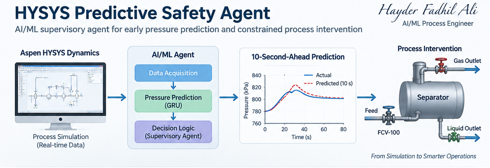
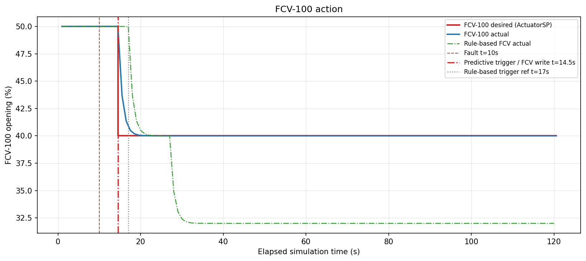
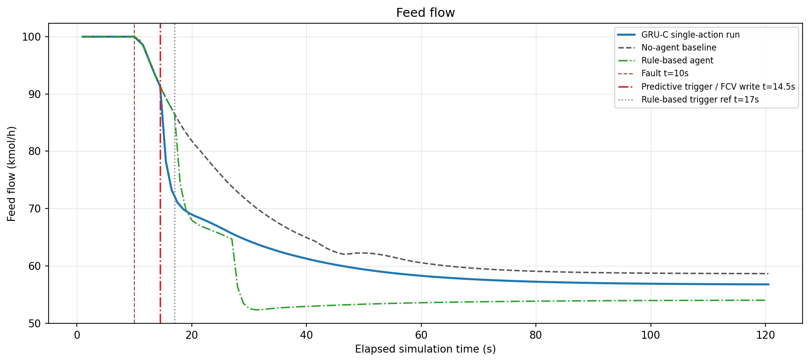
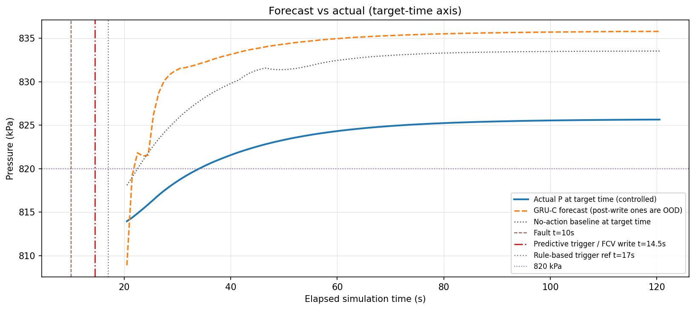

# HYSYS-Predictive-Safety-Agent
AI/ML supervisory agent integrated with Aspen HYSYS Dynamics for 10-second-ahead pressure prediction and constrained process intervention.


# HYSYS Predictive Safety Agent

AI/ML supervisory agent integrated with Aspen HYSYS Dynamics for 10-second-ahead pressure prediction and constrained process intervention.

## Overview

This project explores the integration of **Aspen HYSYS Dynamics** with a Python-based AI/ML supervisory agent for predicting separator pressure excursions and supporting constrained operating intervention.

The workflow is:

**Aspen HYSYS Dynamics → Live Process Data → GRU Prediction → Supervisory Agent → Controlled FCV Action**

The agent predicts separator pressure **10 seconds ahead** using plant-observable process variables.

---

## Process Case

A dynamic two-phase separator is simulated in Aspen HYSYS Dynamics.

Main abnormal scenario:

- Gas outlet valve plugging
- Plugging severities from 10% to 70%
- Normal separator pressure around 800 kPa
- Feed flow around 100 kmol/h

The conventional pressure controller remains active during the tests.

---

## Model

A **GRU (Gated Recurrent Unit)** time-series model is used to predict separator pressure 10 seconds ahead.

Main inputs:

- Separator pressure
- Feed flow
- Gas outlet flow
- Liquid outlet flow
- Vessel temperature
- Pressure controller output
- Feed control valve position
- Gas outlet valve position

The model uses only plant-observable variables.

---

## Supervisory Agent

The agent follows the sequence:

**Observe → Predict → Decide → Act**

The predictive agent continuously reads live HYSYS process data and evaluates whether the future separator pressure is expected to exceed a defined limit.

When the prediction remains above the limit for multiple consecutive samples, the agent can perform a constrained action on the feed control valve.

---

## Live Controlled Test

During the first controlled test:

- Gas outlet valve plugging: 50%
- Predictive trigger: approximately 14.5 s
- Rule-based reference trigger: approximately 17 s
- FCV command: 50% → 40%
- No-agent peak pressure: approximately 833.5 kPa
- Predictive-agent peak pressure: approximately 825.7 kPa
- No significant pressure undershoot
- No post-action oscillation
- One controlled valve action only

This demonstrated the complete loop:

**Observe → Predict → Decide → Act**

---

## Action-Aware GRU

The original GRU performed well before intervention but its post-action prediction degraded because FCV movement was not represented in the original training data.

To address this, a new action-aware dataset was generated with:

- Plugging severities: 30%, 40%, 50%, 60%, 70%
- FCV targets: 45%, 40%, 35%
- 15 controlled trajectories
- 1800 controlled samples
- 2880 samples in the combined dataset

The new Action-Aware GRU was trained to learn both pre-action and post-action dynamics.

Post-action prediction improved significantly compared with the original model.

---

## Current Status

The project currently demonstrates:

- Live HYSYS data acquisition
- 10-second-ahead GRU pressure forecasting
- Predictive supervisory decision logic
- Controlled write-back to FCV-100
- Action-aware post-intervention forecasting
- Comparison with no-agent and rule-based cases

Current work focuses on:

- High-severity generalization
- Noise and repeatability testing
- Wider operating-condition variation
- Robustness before any second-stage intervention
- 

---
## Results

### Controlled Pressure Response


### FCV Action


### Feed Flow Response


### Prediction vs Actual


## Safety Note

This work is intended for **research and simulation purposes**.

The AI/ML supervisory agent is not intended to replace:

- BPCS
- SIS
- PSV
- Certified safety interlocks

The concept is being investigated as an additional predictive supervisory layer that complements the existing protection hierarchy.

---

## Project Structure

```text
HYSYS-Predictive-Safety-Agent/
│
├── src/
├── results/
├── sample_data/
├── README.md
├── requirements.txt
└── .gitignore
